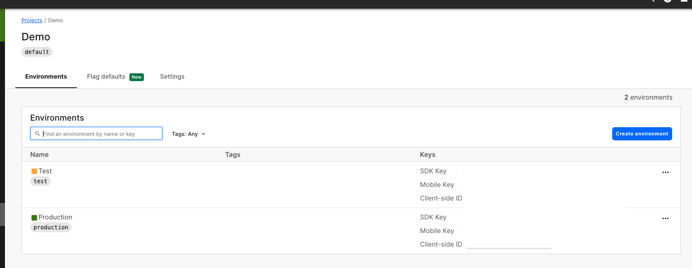
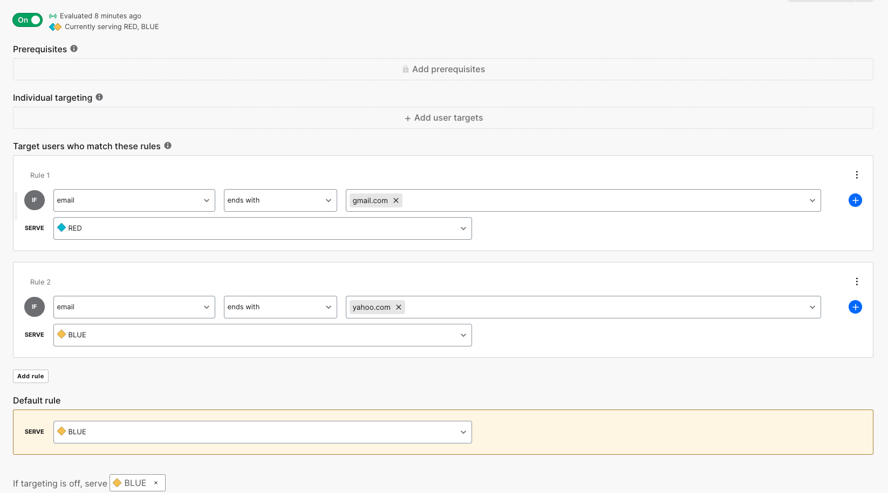

**Feature flags is a software technique that enables teams to make changes without additional code. In this example we will use LaunchDarkly to enable feature based on email address of users** 

We will use feature flag based on defined rules. In this example, I am using feature flag "background"  with two possible values , Blue and Red.

**Pre-Requistie**

* Clone repo 
```
git clone <repourl>

cd into ld-demo
```
* Install launchdarkly SDK for  Python 

```
run pip install requirements.txt
````
* Edit demo.py at line 12 to add your API keys from your launchDarkly account. API key can be accessed on your launcDarkly dashboard from 'Account Settings > Projects> Click project Name> Copy the API key from corresponding environment .




* Following screenshot is an  example of using feature flag  based on target rules. This sample configuration which enables you to configure condition like "contains", "ends with" or operators. Upon recieving user attributes sent by SDK , it returns either a matching variations or you can define default rule below.



* The above Feature flags implements 2 targetting rules and one default rules based on the email address.
* When you run this as it is following the rule targets as shown in picture below, the sample out put will show case background "Blue" or "Red" depending on the email address match
